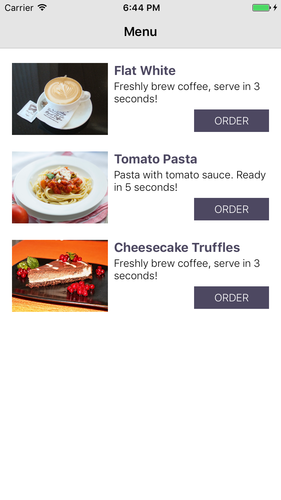
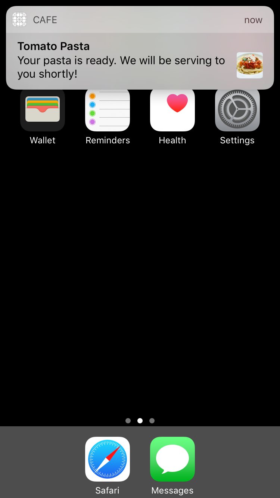
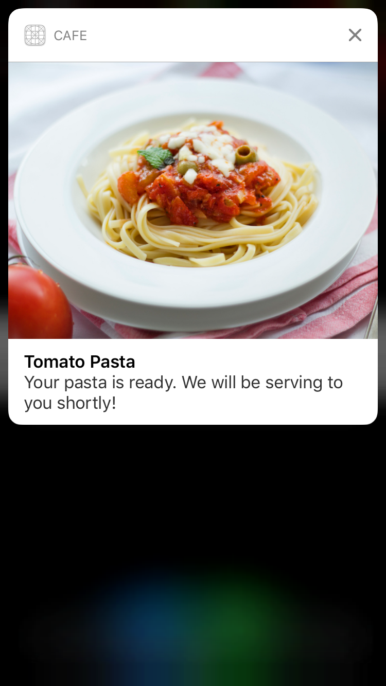

# Overview
A simple cafe ordering app that allow the ordering three item. Each showing a different type of local notification after a short interval using the new iOS 10 `UserNotifications`

The aim is to learn how to use the latest `UserNotifications` to display a text, photo and also GIF that also listen to user action.

## Blog Post
A detailed blog post on this topic can be view [here](https://bot-zeta.herokuapp.com/post/2/).

Screenshot of the apps:

### Version Info
- swift 3.0
- Xcode8
